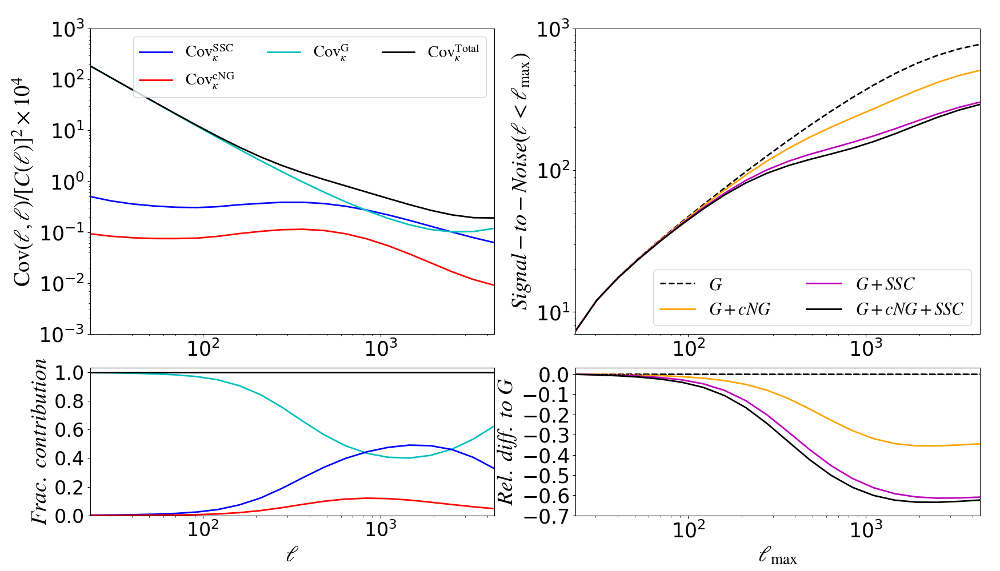

# Super-sample covariance of lensing power spectra

This code was used in the numerical analysis of the paper:

- [Barreira, Krause & Schmidt 2018a](https://arxiv.org/abs/1711.07467), *Complete super-sample lensing covariance in the response approach*

It evaluates the lensing power spectrum covariance matrix including all physical contributions: Gaussian (G), connected non-Gaussian (cNG, up to 1-loop terms) and super-sample covariance (SSC). For the G and cNG terms, it assumes the Limber approximation, but for the SSC term it does also a beyond-Limber full-sky calculation.

This code was subsequently incorporated into the cosmological likelihood analysis code [CosmoLike](https://github.com/CosmoLike/CosmoCov), and later used in

- [Barreira, Krause & Schmidt 2018b](https://arxiv.org/abs/1807.04266), *Accurate cosmic shear errors: do we need ensembles of simulations?*

to demonstrate the accuracy of analytical approaches to the covariance matrix for analyses of current and future large imaging galaxy surveys like DES, Euclid and Vera Rubin.

### Dependencies

- python: numpy, scipy, matplotlib
- python: healpy (pip install --user healpy), for Healpix-format mask operations

### Code overview

- *prepare_for_lensing.py* defines global parameters, variables and functions
- *compute_lensing_G.py* evaluates the G term
- *compute_lensing_cNG.py* evaluates the cNG term
- *compute_lensing_SSC.py* evaluates the SSC term
- *compute_lensing_beyondLimber_SSC.py* evaluates the SSC term beyond the Limber approximation (for this one needs to run also the scripts in *compute_lensing_beyondLimber_flLp_table/* to generate some auxiliary data)

In figures/ there are ploting scripts and the corresponding figures.

### Gallery

Maps of the SSC and G+cNG contributions

Impact of full-sky and beyond Limber corrections to the SSC term

A few slices of the covariance matrix terms

Contributions along the diagonal and impact on the signal-to-noise ratio

Scale and redshift dependence of the two first-order power spectrum response functions that determine the SSC term

